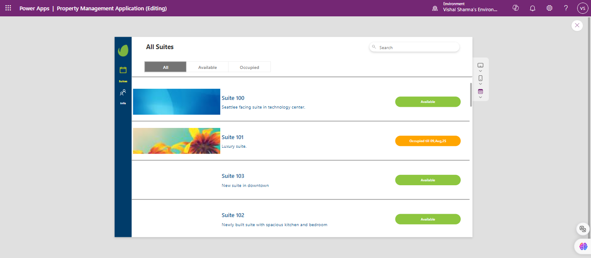
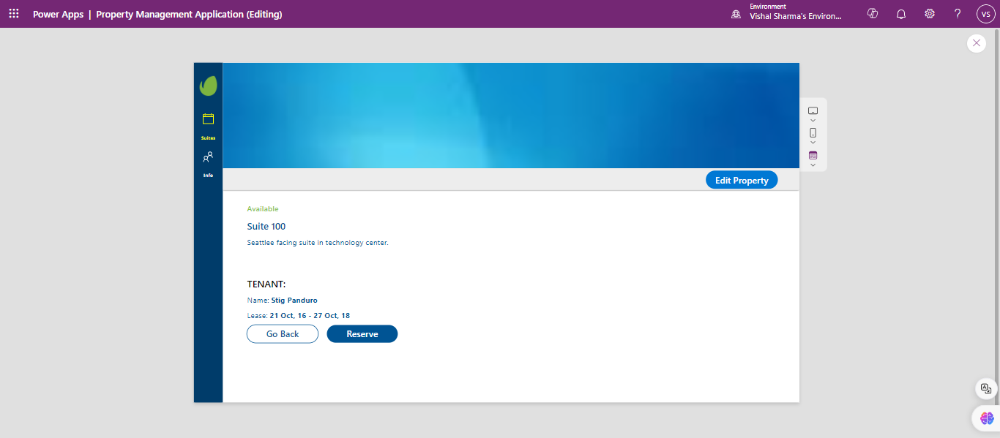
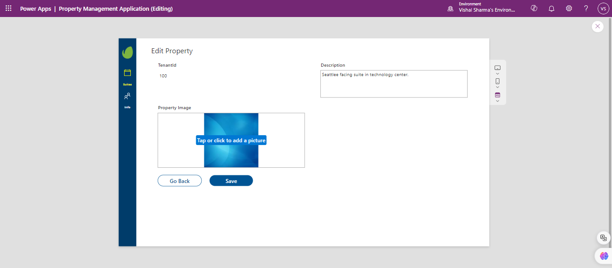
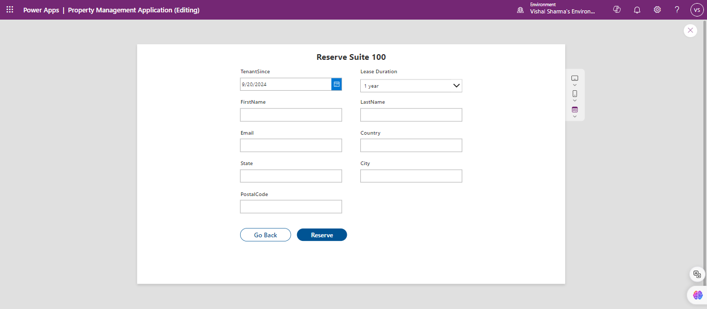
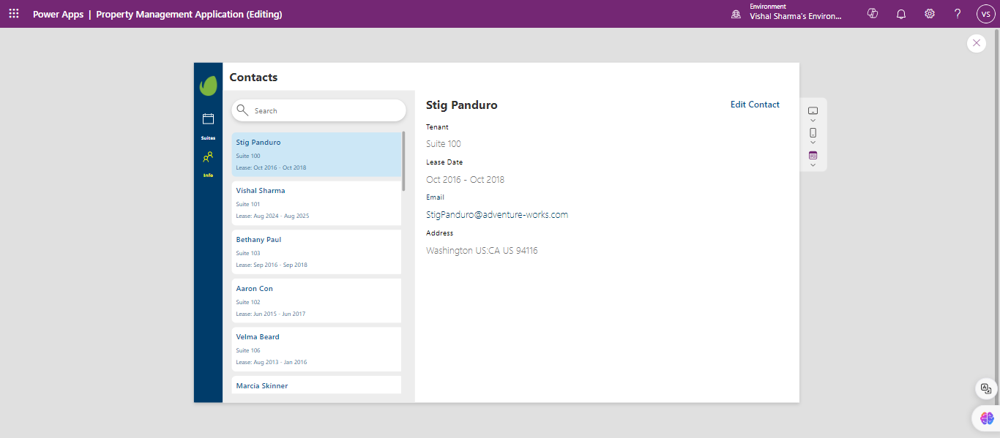
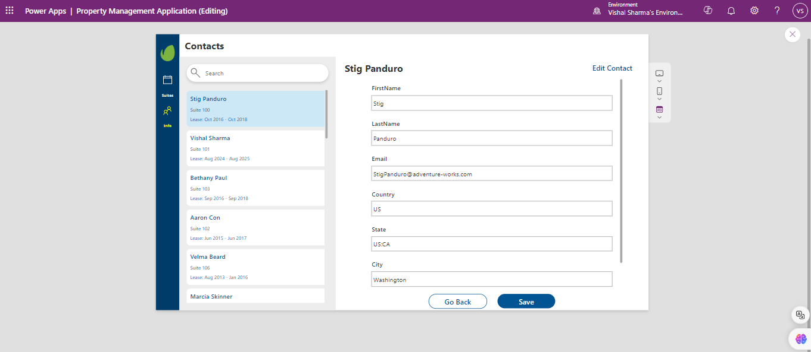
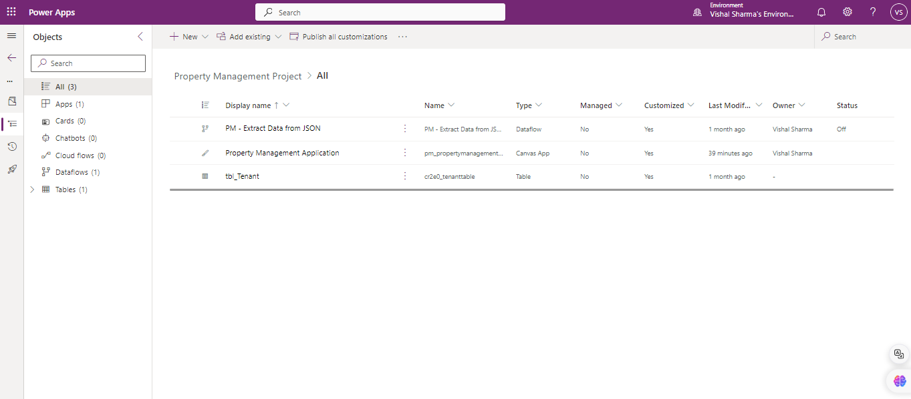
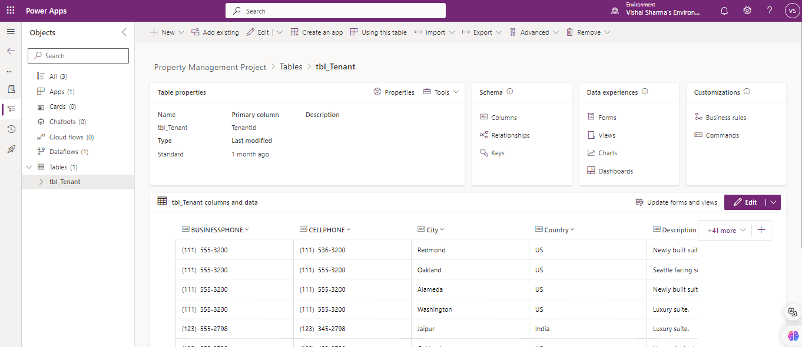

# Property Management Solution

This Power Apps-based solution is designed to manage properties, reservations, and contacts efficiently. It includes a Canvas app for user interaction, a dataflow that transforms JSON data into a usable table format, and a Dataverse table that stores property and contact information. Below are screenshots of key app screens and solution components.

## App Screenshots

### Home Screen

_This is the home screen where users can navigate to different parts of the app._

### Property Details Screen

_Shows detailed information about a selected property._

### Edit Property Screen

_Allows users to edit the details of a selected property._

### Reserve Property Screen

_Enables users to make a reservation for a specific property._

### Contacts Screen

_Displays the list of contacts associated with the properties._

### Edit Contact Screen

_Allows users to edit contact details._

## Solution Overview

_This screenshot shows the complete solution structure, including all components._

## Dataverse Table

_This screenshot shows the schema and fields of the main Dataverse table used in the app._
